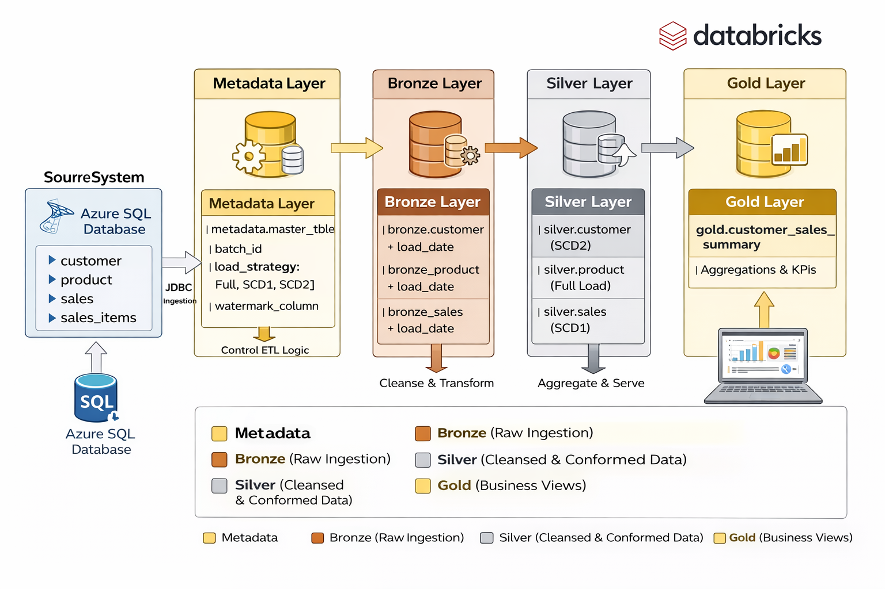
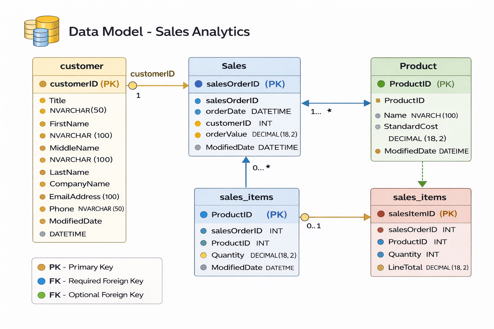

# 🚀 Azure SQL to Databricks Medallion Architecture for Sales Analytics

## 📌 Project Overview
This project demonstrates a **scalable, metadata-driven ETL pipeline** built using **Azure SQL, Azure Databricks, and PySpark** following the **Medallion Architecture (Bronze, Silver, Gold)**.

The pipeline ingests data from Azure SQL, performs data cleansing and transformation, implements **SCD Type 1 & Type 2**, and generates **business-ready analytics views**.

---

## Architecture Diagram

---

## 🏗️ Architecture Overview

### 🔹 Source System
- Azure SQL Database
- Tables:
  - `customer`
  - `product`
  - `sales`
  - `sales_items`

---

## 🥉 Bronze Layer (Raw Data)
- Ingest data using JDBC from Azure SQL
- Stores raw data with minimal transformation
- Adds audit column: `load_date`

Tables:
- `bronze.customer`
- `bronze.product`
- `bronze.sales`

---

## 🥈 Silver Layer (Cleansed & Transformed)
- Data cleaning, validation, and transformation
- Implements:
  - **Full Load**
  - **SCD Type 1 (Overwrite / Upsert)**
  - **SCD Type 2 (Historical Tracking)**

Tables:
- `silver.customer` (SCD2)
- `silver.product`
- `silver.sales` (SCD1)

---

## 🥇 Gold Layer (Business Insights)
- Aggregated and analytics-ready data

Example:
- `gold.customer_sales_summary`
  - Total sales per customer
  - Last order date
  - Active/inactive status

---

## Data Model

---
## ⚙️ Metadata-Driven Framework

### 📄 metadata.master_tble
Tracks:
- `batch_id`
- `source_tbl_name`
- `bronze_tbl_name`
- `silver_tbl_name`
- `data_load_strategy`
- `watermark_column`

### 🔄 Supported Load Strategies
- `FullLoad`
- `DeltaLoad_SCD1`
- `DeltaLoad_SCD2`

---

## 🔁 ETL Pipeline Flow

1. Read metadata based on `batch_id`
2. Extract data from Azure SQL using JDBC
3. Apply transformation logic based on strategy:
   - Full Load
   - Incremental Load
   - SCD1 / SCD2
4. Load into Bronze → Silver
5. Update watermark in metadata
6. Build Gold layer views

---

## 🧠 Key Features

- ✅ Metadata-driven pipeline  
- ✅ Incremental loading using watermark  
- ✅ SCD Type 1 & Type 2 implementation  
- ✅ Data quality handling  
- ✅ Scalable Medallion Architecture  
- ✅ Delta Lake support  

---

## 🛠️ Tech Stack

- Azure Databricks
- PySpark
- Azure SQL Database
- Delta Lake
- SQL

---

## ▶️ How to Run

### 1️⃣ Setup Azure Resources
- Create Resource Group
- Create Azure SQL Database
- Create Azure Databricks Workspace

### 2️⃣ Load Source Data
- Create tables in Azure SQL
- Insert sample data

### 3️⃣ Configure Metadata Table
- Insert records for each pipeline

### 4️⃣ Execute Pipelines
- Pass `batch_id` as parameter
- Run respective notebook:
  - Full Load
  - SCD1
  - SCD2

---

## 📊 Sample Output

### Gold Layer View
`gold.customer_sales_summary`

Includes:
- Customer details
- Total sales value
- Last order date
- Active status

---

## 🚧 Data Quality Handling

- Null checks
- Invalid records filtering
- Duplicate removal
- Negative values handling

---

## 📈 Future Enhancements

- Add orchestration using Azure Data Factory / Fabric Pipelines
- Implement logging & monitoring
- Add unit testing framework
- Integrate Power BI dashboards

